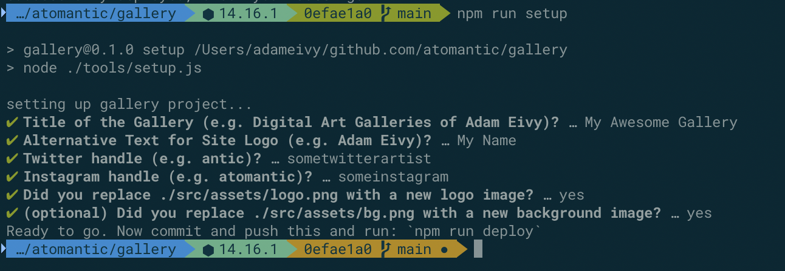

# Hic Et Nunc Digital Art Galleries

This repo creates a set of gallery pages based on IPFS hosted hicetnunc.xyz NFT token artworks:

https://adameivy.com/gallery

# Forking / Making it Your Own

You can create your own gallery website with nothing more than a github account.

1. fork this repo in to your github account
2. install Node.js: https://nodejs.org/en/
3. clone your fork to your machine and navigate to the folder
4. install dependencies: `npm install`
5. run the setup script: `npm run setup`



6. Add items to your gallery

```
# this will create the gallery named "prosopagnosia" if it doesn't exist
# add it will add the object 26001 to that gallery
node tools/add_item.js prosopagnosia 26001
```

7. Remove items from the gallery

```
# this will remove object 26001 from the prosopagnosia gallery
node tools/rm_item.js prosopagnosia 26001
```

8. Change the favicon.ico files

- You can upload a new image to a favicon creator like this one: https://favicon.io
- Download the images and overwrite the files in `./public/`

9. Commit your changes: `git add -A .; git commit -m 'initial gallery setup'`
10. Push to your own fork: `git push -u origin main`
11. Deploy to github pages: `npm run deploy`

In a few minutes, your site will be at https://{YOUR_GITHUB_USERNAME}.github.io/gallery

# Working with the codebase

- This site is built using Vue.js, SCSS, and pug
- Text and social media links are in `config.json`
- `./data/galleries.json` can be edited to rearrange items, to set new main thumbnails, add event countdowns, and gallery level descriptions.
- `./data/gallery_data.json` is the downloaded object data from hicetnunc.xyz

### Local testing

```
npm run serve
```
